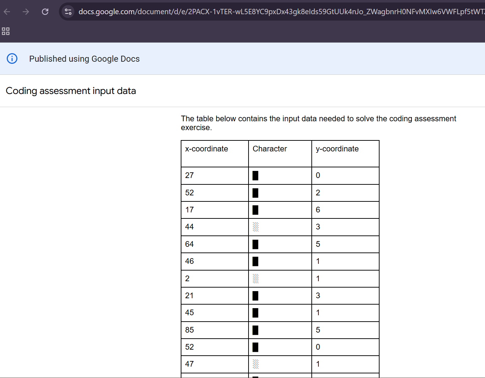
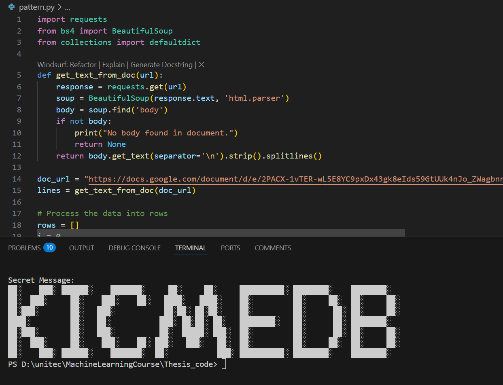

# 🕵️‍♀️ Secret Message Hackathon Challenge

[](https://www.python.org/)
[](https://github.com/ThakurAyushi404/secret-message-Hackthonchallenge/stargazers)
[](https://github.com/ThakurAyushi404/secret-message-Hackthonchallenge/commits/main)

This repository contains my solution to an exciting coding challenge from the **Data Annotation Hackathon**. The goal was to decode a hidden message embedded in a public Google Doc using `(x, y)` coordinates and visual characters (`█`, `░`). It combined web scraping, parsing, and creative grid mapping!

---

## 🎯 Challenge Objective

- Extract data from a public Google Doc
- Parse `(x, y)` coordinate and character data
- Plot characters on a 2D grid
- Reveal the hidden message

---

## 🧠 My Approach

1. Scraped the doc using `requests` + `BeautifulSoup`
2. Mapped characters to coordinates using Python
3. Printed a grid of characters to visualize the secret message

✅ **Decoded Secret Message:*KICMEDB*

🧩 Final Output: **KICMEDB**

---

## 🛠 Tech Stack

- Python 3.10+
- requests
- beautifulsoup4

---
## 🖼️ Screenshots

### 📥 Input Snippet from Google Doc


### 📤 Output Grid

## 🚀 How to Run

```bash
git clone https://github.com/ThakurAyushi404/secret-message-Hackthonchallenge.git
cd secret-message-Hackthonchallenge
pip install -r requirements.txt
python decode.py

